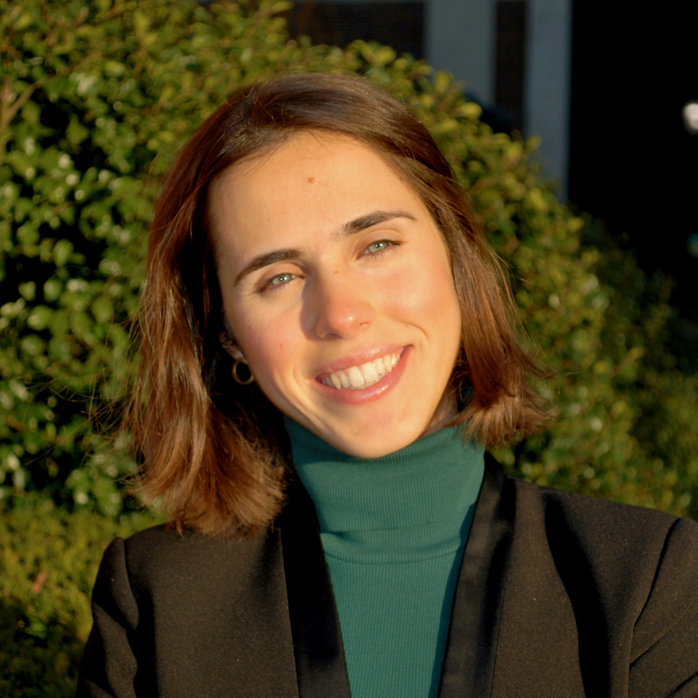

## Meritxell Mallafré Larrosa

 
## Education

### Master of Public Health (MPH)

**Columbia University, Mailman School of Public Health	New York (United States)**

*September/21– May/23 (exp)*

* Global Health Certificate, Department of Population and Family Health 
* Cumulative GPA 4.15 (A+)
* La Caixa Fellow, recipient of a full scholarship for the MPH program, 2020
* President, Womnx4Womxn Student Association (W4W), 2022

### Medical Doctor (MD)

**University of Barcelona, Hospital Clínic Campus	Barcelona (Spain)**

*September/13 – June/20*

* Cumulative GPA 3.74 (A)
* National and International Executive Boards, International Federation of Medical Students’ Associations (IFMSA), 2013-18 
* ERASMUS+ exchange semesters: 
  - Spring 2018 at Charles University, Third Faculty of Medicine, Prague (Czechia)
  - Fall 2020 at Aarhus University, Aarhus (Denmark)

## Work experience

### Early Career Visiting Scientist (ECVS)

**International Agency for Research on Cancer (IARC-WHO)**

*May – Aug/22, France-India*

Collaborated on the Access Cancer Care India (ACCI) project within IARC’s Early Detection, Prevention and Infections Branch. 

* Drafted and validated a protocol and associated tools for a cancer-specific Health Systems Assessment (HSA), capturing the continuum of services from screening and early detection to timely treatment.
* Performed healthcare facility visits in the 3 implementing Indian states and its selected rural blocks, partaking in local stakeholder engagement activities and HSA tools validation. Spent 1.5 months involved in field operations in India.
* Conducted a quick review on tools for situational analyses of the Indian healthcare system capacity and barriers to accessing cancer services in rural settings. 

### Public Health Physician

**Public Health Agency of Catalonia (ASPCAT)**

*July/20– August/21, Spain*

Joined the COVID-19 epidemiological response team for Catalonia (population of 7.7M) at the Sub-Directorate General of Surveillance and Public Health Emergency Response (SGVERSP), within the Ministry of Health (MoH).

* Monitored contact tracing (CT) performance indicators (KPIs) and periodically reported to the MoH COVID-19 response taskforce.
* Trained 500+ contact tracers over a 2-month scale-up phase on the program’s execution, protocols, and digital databases (Go.Data-like).
* Lead 2 CT-related epidemiological research projects, the results of which informed the governmental public health strategy.
* Contributed to the regular COVID-19 response protocol updates, including the integration and interoperability of both the microbiology laboratory and CT databases, as well as the inclusion of SARS-CoV-2 variants of concern.
* Presented Catalonia’s CT program monitoring and evaluation strategy and its 2020-21 KPI results to the WHO GOARN network.

Research Associate
Association of European Cancer Leagues (ECL)	Mar/19 – ongoing, remote
Providing technical expertise for ECL’s cancer control research activities, as well as consulting on European health policy affairs.
•	Evaluated the impact of the European Code Against Cancer (ECAC) through a qualitative study involving 30+ key stakeholders and policymakers. Co-chaired the presentation of its results during the European Public Health conference 2021.
•	Developed a novel digital health intervention promoting healthy lifestyles among adolescents, under the Third EU Health Programme project WASABY. Drafted its ECAC-based content, coordinated the software and design teams, conducted its piloting activities, guided WASABY app dissemination activities, and performed the intervention’s impact assessment.
•	Designed, conducted, and analysed a survey-based study of policies towards broadening cervical cancer screening coverage among vulnerable groups (CBIG-SCREEN H2020, results under publication in collaboration with IARC-WHO).
•	Conducted communication and stakeholder engagement activities for the MyPeBS H2020 project, a multi-centric randomized clinical trial investigating personalised breast cancer screening in 6 European countries. 
•	Co-authored a manuscript advocating for the update of the 2003 European Council recommendations on cancer screening, which lead to an updated draft in 2022.
•	Supported ECL’s mandate to disseminate the ECAC in Europe, including the development of an interactive web map, and the validation of the Spanish modules for the IARC-WHO ECAC e-learning modules.
•	Assisted with ECL’s advocacy activities, including the drafting of a position paper on Europe’s Beating Cancer Plan, NCD-related consultations, and the convening of the MEPs against cancer (MAC) interest group.
•	Reported and supported the logistics of several ECL internal and civil society meetings, co-organised 4 capacity building workshops for ECL membership, as well as attended 30+ EU projects meetings and conferences in Europe.
•	Contributed to ECL’s EU4Healht funds application, for which the NGO was awarded two 1M+ grants in collaboration with IARC-WHO among other consortia.
•	Represented ECL at a national level as a Youth Ambassador for the ECAC.
Research Assistant
IDIBAPS – Hospital Clínic de Barcelona (HCB)	Nov/18 – June/19, Spain
Completed the MD graduation thesis “Breast Cancer Brain Metastasis: Clinical, Pathological and Molecular Characterization” under the supervision of Dr. Aleix Prat, head of the research group “Translational genomics and targeted therapeutics in solid tumors”.
•	Organized the study design and sample collection, conducted its data collection and analysis, and published its results in a peer-review journal.
•	Presented the thesis results at both the European and Spanish Society of Medical Oncology (ESMO and SEOM) conferences in 2019.
•	Was awarded a scholarship by the Spanish Association Against Cancer (AECC) for emerging clinical researchers.
European Solidarity Corps Trainee 
Association of European Cancer Leagues (ECL)	Oct/18 – Feb/19, Belgium
Joined ECL to provide cross-departmental support in the NGO’s portfolio of activities.
•	Managed a network of 60+ Youth Ambassadors (YA) for the European Code Against Cancer (ECAC) and guided its strategy update and implementation.
•	Conducted social media communications, capitalising in key events such as World Cancer Day (in coordination with UICC) and the European Week Against Cancer.
•	Supported events logistics and reporting, and coordinated the academic program for the capacity building YA summer school 2019.
•	Contributed to ECL’s Cancer Prevention research activities, including WASABY and MyPeBS projects (outcomes described above).
•	Provided technical review to cancer-focused European policy affairs, notably for the Access to Medicines team and the MEPs Against Cancer (MAC) interest group.

## Extracurricular training

### Clinical training

COVID-19 unit Clerkship. April-May 2020. Hospital Clínic de Barcelona (Spain)
Medical Oncology Clerkship. September 2018. Centre Hospitalier Universitaire Vaudois (CHUV), Lausanne (Switzerland)
Clinical Hematology Clerkship (ICMHO). July 2017. Hospital Clínic de Barcelona (Spain)

### Biomedical Research training

Internship at the research group on Tumorigenesis and epigenetics in Melanoma. July 2016. Pathology Department, Lady Davis Institute (McGill University), Montréal (Canada)
Internship at the research group on Huntington’s Disease. 2014-15. Cellular Biology, Neurosciences & Immunology Department (University of Barcelona, IDIBAPS) (Spain)
Externship at CRESIB (International Health Institute Barcelona). September 2014. IS Global, Barcelona (Spain)
Internship with IFMSA SCORE. July 2014. Genetics department, Chiba University (Japan)

### Certifications and Diplomas

* **5th Implementation Science School**. Global Alliance for Chronic Diseases, September 2022 (online) 
* **Human Subjects Protection Biomed**. CITI Program, January 2022 (ID Credential 46982605) 
* **Project management with Agile, Scrum, and Kanban methodologies**. Public Health Agency of Catalonia (ASPCAT), May 2021 (Barcelona, Spain)
International Women's Health and Human Rights. Stanford University, August 2020 (Coursera certificate ID HVAJ7GW5W6CW)
Measuring and Maximizing Impact of COVID-19 Contact Tracing. John Hopkins University, August 2020 (Coursera certificate ID 3DXHDQ56MMD5)
Implementing Cancer Prevention and Early Detection. International Agency of Research on Cancer – World Health Organisation (IARC-WHO), July 2019 (Lyon, France)
Climathon on City Micro-Mobility. EIT Climate-KIC, November 2019 (Aarhus, Denmark)
ECAC Youth Ambassador Summer Schools. Association of European Cancer Leagues, August 2020 (online), 2019 (Ljubljana, Slovenia) and 2018 (Paris, France)
Access to Essential Medicines. Nordic World Health Organization (WHO) simulation, August 2018 (Copenhagen, Denmark)
Policy, the Word to Change the World. IFMSA PreEuRegMe, April 2018 (Graz, Austria)
IFMSA Train the Trainer (TNT). IFMSA pre-General Assembly, August 2017 (Arusha, Tanzania)
Medicine Access and Innovation. IS Global Summer School, July 2017 (Barcelona, Spain)

More information on Meritxell's background is available on [LinkedIn](https://www.linkedin.com/in/meritxellml/)